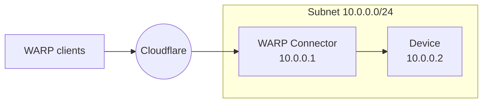
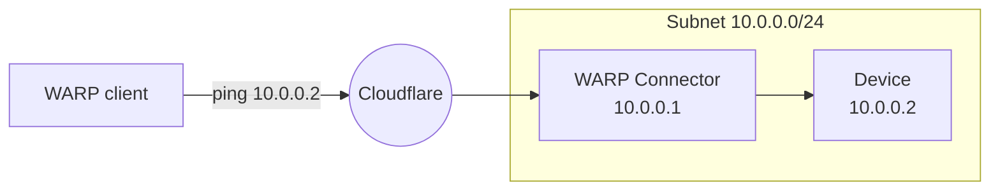

import { Render, Details, GlossaryTooltip, TabItem, Tabs } from "~/components";

This guide covers how to connect WARP client user devices to a private network behind WARP Connector. In this example, we will create a WARP Connector for subnet `10.0.0.0/24` and install it on `10.0.0.1`.



## Prerequisites

- A Linux host [^1] on the subnet.
- For WARP Connector to connect to Cloudflare services, your firewall should allow inbound/outbound traffic for the [WARP IP addresses, ports, and domains](/cloudflare-one/team-and-resources/devices/warp/deployment/firewall/).
- For WARP clients to connect to your subnet, your firewall should allow inbound traffic from  your [device IPs](/cloudflare-one/team-and-resources/devices/warp/configure-warp/device-ips/).

## 1. Install a WARP Connector

<Render file="tunnel/warp-connector-install" product="cloudflare-one" />

## 2. (Recommended) Create a device profile

<Render file="tunnel/warp-connector-device-profile" product="cloudflare-one" />

## 3. Route device IPs through Cloudflare

WARP clients and WARP Connectors are accessed using their [device IP](/cloudflare-one/team-and-resources/devices/warp/configure-warp/device-ips/). Therefore, traffic to your device IPs must route through Cloudflare on both the WARP Connector host and WARP client devices.

1. In your WARP Connector device profile, go to [Split Tunnels](/cloudflare-one/team-and-resources/devices/warp/configure-warp/route-traffic/split-tunnels/).
2.
	<Render file="tunnel/cgnat-split-tunnels" product="cloudflare-one" params={{ feature: "WARP Connector"}}  />

3. Repeat the previous steps for all WARP client device profiles.

## 4. Route traffic from subnet to WARP Connector

Depending on where you installed the WARP Connector, you may need to configure other devices on the subnet to route requests through WARP Connector.

### Option 1: Default gateway

<Render file="tunnel/warp-connector-default-gateway" product="cloudflare-one" />

### Option 2: Alternate gateway

<Render
	file="tunnel/warp-connector-alternate-gateway"
	product="cloudflare-one"
/>

#### Add IP route to router

`100.96.0.0/12` is the default CIDR for all user devices running the [WARP client](/cloudflare-one/team-and-resources/devices/warp/). On your router, add a rule that routes the destination IP `100.96.0.0/12` to the WARP Connector host machine (`10.0.0.100`).

<Render
	file="tunnel/warp-connector-alternate-gateway-flow"
	product="cloudflare-one"
/>

### Option 3: Intermediate gateway

<Render
	file="tunnel/warp-connector-intermediate-gateway"
	product="cloudflare-one"
/>

#### Add IP route to devices

To route all <GlossaryTooltip term="WARP CGNAT IP">CGNAT IP</GlossaryTooltip> traffic through WARP Connector:

<Tabs> <TabItem label="Linux">

```sh
sudo ip route add 100.96.0.0/12 via <WARP-CONNECTOR-IP> dev eth0
```

</TabItem> <TabItem label="macOS">

```sh
sudo route -n add -net 100.96.0.0/12 <WARP-CONNECTOR-IP>
```

</TabItem>

<TabItem label="Windows">

```bash
route /p add 100.96.0.0/12 mask 255.255.255.255 <WARP-CONNECTOR-IP>
```

</TabItem> </Tabs>

<Render file="tunnel/warp-connector-verify-routes" product="cloudflare-one" />

## 5. Test the WARP Connector

You can now send a request from a WARP client user device to your subnet. To test connections to the WARP Connector host, on the WARP client device run `ping 10.0.0.1`. To connect to a device behind WARP connector, run `ping 10.0.0.2`.



[^1]:
    <Render
    	file="tunnel/warp-connector-linux-packages"
    	product="cloudflare-one"
    />


